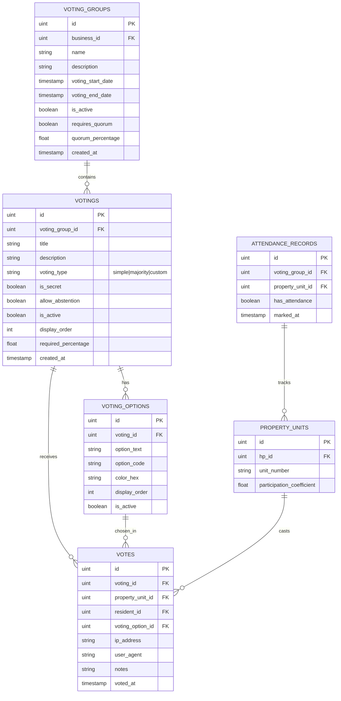
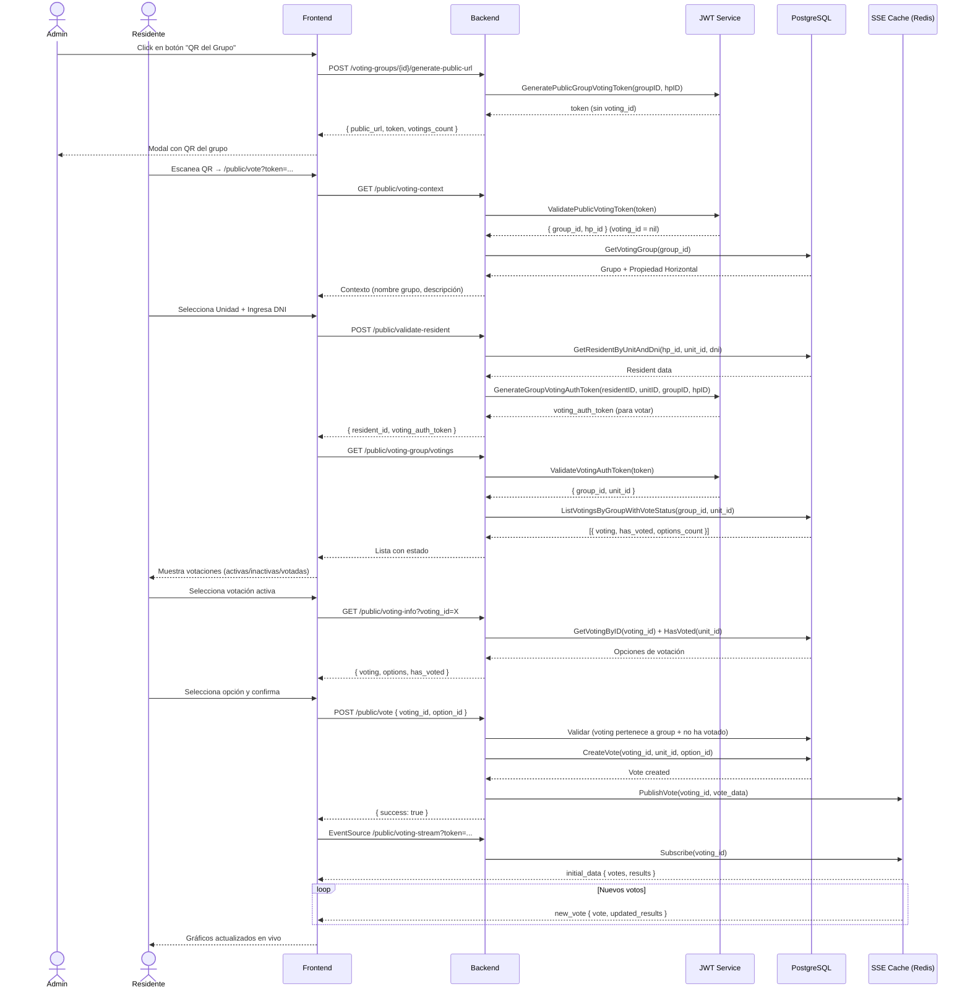
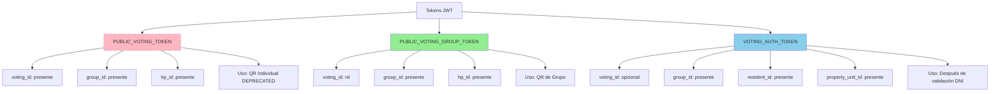

# 🗳️ Módulo de Votaciones - Horizontal Properties

Sistema completo de gestión de votaciones para propiedades horizontales (condominios, conjuntos residenciales). Implementa votaciones electrónicas con acceso público vía QR, resultados en tiempo real y múltiples tipos de votación.

---

## 📋 Tabla de Contenidos

- [Características](#características)
- [Arquitectura](#arquitectura)
- [Modelos de Datos](#modelos-de-datos)
- [Flujos Principales](#flujos-principales)
- [API Endpoints](#api-endpoints)
- [Tests](#tests)
- [Configuración](#configuración)

---

## ✨ Características

### Gestión de Grupos de Votación
- ✅ Creación de grupos de votación (ej: "Asamblea Ordinaria 2024")
- ✅ Fechas de inicio y fin configurables
- ✅ Quórum opcional con porcentaje requerido
- ✅ Activación/Desactivación de grupos

### Votaciones
- ✅ Múltiples tipos: Simple, Mayoría, Personalizado
- ✅ Votaciones secretas o públicas
- ✅ Opción de abstención configurable
- ✅ Porcentaje de aprobación requerido
- ✅ Orden de visualización personalizable

### Acceso Público
- ✅ **QR por Grupo**: Un solo QR para acceder a todas las votaciones del grupo
- ✅ Validación de residentes por DNI + Unidad
- ✅ Tokens JWT con expiración configurable (default: 24h)
- ✅ Lista de votaciones con estado (activa, ya votó, inactiva)

### Votación
- ✅ Registro de votos con IP y User Agent
- ✅ Un voto por unidad por votación
- ✅ Eliminación de votos (solo administradores)
- ✅ Control de asistencia por votación

### Resultados en Tiempo Real
- ✅ SSE (Server-Sent Events) para actualizaciones en vivo
- ✅ Gráficos con colores personalizables
- ✅ Porcentajes y conteo de votos
- ✅ Desglose por unidad residencial

---

## 🏗️ Arquitectura

El módulo sigue **Arquitectura Hexagonal** estricta:

```
vote/
├── bundle.go                    # Inicialización del módulo
└── internal/
    ├── domain/                  # 🎯 CAPA NÚCLEO
    │   ├── entities/            # Entidades del dominio (sin tags)
    │   ├── dtos/                # DTOs para transferencia de datos
    │   ├── ports.go             # Interfaces (IRepository, IUseCase)
    │   └── errors/              # Errores de dominio
    │
    ├── app/                     # 📦 CAPA DE APLICACIÓN
    │   ├── usecasevotinggroups/ # Casos de uso de grupos
    │   ├── usecasevotings/      # Casos de uso de votaciones
    │   ├── usecasevotes/        # Casos de uso de votos
    │   ├── usecaseresults/      # Casos de uso de resultados
    │   └── usecasepublic/       # ✨ Casos de uso públicos (QR, validación)
    │
    └── infra/                   # 🔌 CAPA DE INFRAESTRUCTURA
        ├── primary/             # Adaptadores primarios (entrada)
        │   └── handlers/        # HTTP handlers (Gin)
        │       ├── handlerpublic/      # ✨ Endpoints públicos (QR)
        │       ├── handlervotinggroups/
        │       ├── handlervotings/
        │       ├── handlervotes/
        │       └── handlerresults/
        │
        └── secondary/           # Adaptadores secundarios (salida)
            ├── repository/      # PostgreSQL (GORM)
            └── cache/           # Redis (resultados en tiempo real)
```

### Reglas de Dependencia

```
Infrastructure → Application → Domain
    (Gin)           (Use Cases)    (Pure Go)
```

- **Domain**: CERO dependencias externas. Solo Go stdlib + UUID
- **Application**: Solo depende de Domain
- **Infrastructure**: Implementa interfaces de Domain

---

## 🗂️ Modelos de Datos

### Esquema de Base de Datos



---

## 🔄 Flujos Principales

### Diagrama de Flujo: Votación Pública con QR de Grupo



### Tipos de Tokens JWT



---

## 🌐 API Endpoints

### Endpoints Privados (Admin)

#### Grupos de Votación
```http
POST   /api/v1/horizontal-properties/voting-groups
GET    /api/v1/horizontal-properties/voting-groups?business_id={id}
GET    /api/v1/horizontal-properties/voting-groups/{id}
PUT    /api/v1/horizontal-properties/voting-groups/{id}
DELETE /api/v1/horizontal-properties/voting-groups/{id}

# ✨ NUEVO: Generar QR de Grupo
POST   /api/v1/horizontal-properties/voting-groups/{id}/generate-public-url
```

**Request:** `POST /voting-groups/{id}/generate-public-url`
```json
{
  "business_id": 19,
  "duration_hours": 24,
  "frontend_url": "https://votacion.miconjunto.com/vote"
}
```

**Response:**
```json
{
  "success": true,
  "data": {
    "public_url": "https://votacion.miconjunto.com/vote?token=eyJ...",
    "token": "eyJ...",
    "voting_group_id": 10,
    "hp_id": 19,
    "expires_in_hours": 24,
    "votings_count": 5,
    "group_name": "Asamblea Ordinaria 2024"
  }
}
```

#### Votaciones
```http
POST   /api/v1/horizontal-properties/voting-groups/{group_id}/votings
GET    /api/v1/horizontal-properties/voting-groups/{group_id}/votings
GET    /api/v1/horizontal-properties/votings/{id}
PUT    /api/v1/horizontal-properties/votings/{id}
DELETE /api/v1/horizontal-properties/votings/{id}
POST   /api/v1/horizontal-properties/votings/{id}/activate
POST   /api/v1/horizontal-properties/votings/{id}/deactivate
```

#### Opciones de Votación
```http
POST   /api/v1/horizontal-properties/votings/{voting_id}/options
GET    /api/v1/horizontal-properties/votings/{voting_id}/options
PUT    /api/v1/horizontal-properties/voting-options/{id}/status
DELETE /api/v1/horizontal-properties/voting-options/{id}
```

#### Votos y Resultados
```http
POST   /api/v1/horizontal-properties/votes
GET    /api/v1/horizontal-properties/votings/{id}/results
GET    /api/v1/horizontal-properties/votings/{id}/details
DELETE /api/v1/horizontal-properties/votes/{id}
```

### Endpoints Públicos (Residentes)

```http
# Contexto inicial
GET    /api/v1/public/voting-context
       Header: Authorization: Bearer {PUBLIC_VOTING_TOKEN}

# Validación de residente
POST   /api/v1/public/validate-resident
       Header: Authorization: Bearer {PUBLIC_VOTING_TOKEN}
       Body: { "property_unit_id": 45, "dni": "12345678" }

# ✨ NUEVO: Lista de votaciones del grupo
GET    /api/v1/public/voting-group/votings
       Header: Authorization: Bearer {VOTING_AUTH_TOKEN}

# Información de votación específica
GET    /api/v1/public/voting-info?voting_id={id}
       Header: Authorization: Bearer {VOTING_AUTH_TOKEN}

# Registrar voto
POST   /api/v1/public/vote
       Header: Authorization: Bearer {VOTING_AUTH_TOKEN}
       Body: { "voting_id": 45, "voting_option_id": 123 }

# Stream de resultados (SSE)
GET    /api/v1/public/voting-stream?token={VOTING_AUTH_TOKEN}
```

**Response:** `GET /public/voting-group/votings`
```json
{
  "success": true,
  "data": {
    "voting_group": {
      "id": 10,
      "name": "Asamblea Ordinaria 2024",
      "voting_start_date": "2024-03-01T08:00:00Z",
      "voting_end_date": "2024-03-15T23:59:59Z"
    },
    "votings": [
      {
        "id": 45,
        "title": "Aprobación de presupuesto",
        "voting_type": "simple",
        "is_active": true,
        "has_voted": false,
        "options_count": 3,
        "display_order": 1
      },
      {
        "id": 46,
        "title": "Elección de Consejo",
        "voting_type": "majority",
        "is_active": false,
        "has_voted": false,
        "options_count": 8,
        "display_order": 2
      }
    ],
    "total_votings": 5,
    "active_votings": 3,
    "user_votes_count": 1
  }
}
```

---

## 🧪 Tests

### Estructura de Tests

```
vote/
└── internal/
    └── app/
        ├── test/
        │   └── mocks/                 # Mocks compartidos
        │       ├── logger_mock.go
        │       ├── voting_cache_mock.go
        │       └── voting_repository_mock.go
        │
        ├── usecasevotinggroups/test/  # Tests de grupos
        ├── usecasevotings/test/       # Tests de votaciones
        ├── usecasevotes/test/         # Tests de votos
        └── usecasepublic/test/        # ✨ Tests públicos (QR)
```

### Ejecutar Tests

```bash
# Todos los tests del módulo vote
go test ./services/horizontalproperty/vote/... -v

# Solo tests del use case público
go test ./services/horizontalproperty/vote/internal/app/usecasepublic/test/... -v

# Con coverage
go test ./services/horizontalproperty/vote/... -cover

# Coverage detallado
go test ./services/horizontalproperty/vote/... -coverprofile=coverage.out
go tool cover -html=coverage.out
```

### Cobertura Actual

| Módulo | Cobertura | Tests |
|--------|-----------|-------|
| usecasevotinggroups | ✅ 85% | 12 tests |
| usecasevotings | ✅ 80% | 15 tests |
| usecasevotes | ✅ 75% | 8 tests |
| usecasepublic | ✅ 90% | 4 tests |

---

## ⚙️ Configuración

### Variables de Entorno

```env
# JWT
JWT_SECRET=your-secret-key-here
JWT_REFRESH_SECRET=your-refresh-secret-here

# Base de datos
DB_HOST=localhost
DB_PORT=5432
DB_USER=postgres
DB_PASSWORD=your-password
DB_NAME=reserve_db

# Redis (para SSE)
REDIS_HOST=localhost
REDIS_PORT=6379
REDIS_PASSWORD=
REDIS_DB=0

# API
HTTP_PORT=3050
APP_ENV=development
```

### Inicialización del Módulo

El módulo se inicializa automáticamente en `bundle.go`:

```go
func New(
    router *gin.RouterGroup,
    database db.IDatabase,
    logger log.ILogger,
    jwtSecret string,
    cache cache.ICache,
) {
    // 1. Repository
    repo := repository.New(database, environment)

    // 2. Cache Service
    votingCache := cacheimpl.New(cache, logger)

    // 3. Use Cases
    votingGroupsUC := usecasevotinggroups.New(repo, votingCache, logger)
    votingsUC := usecasevotings.New(repo, votingCache, logger)
    votesUC := usecasevotes.New(repo, votingCache, logger)
    resultsUC := usecaseresults.New(repo, logger)
    publicUC := usecasepublic.New(repo, votingCache, logger)

    // 4. Handlers
    handlergroups.New(votingGroupsUC, logger, jwtSecret).RegisterRoutes(router)
    handlervotings.New(votingsUC, logger).RegisterRoutes(router)
    handlervotes.New(votesUC, logger).RegisterRoutes(router)
    handlerresults.New(resultsUC, logger, votingCache).RegisterRoutes(router)
    handlerpublic.New(publicUC, votesUC, resultsUC, sharedUC, votingsUC, logger, jwtSecret, votingCache).RegisterRoutes(router)
}
```

---

## 📊 Métricas y Logs

### Logs Estructurados

```go
logger.Info(ctx).
    Uint("voting_id", votingID).
    Uint("resident_id", residentID).
    Msg("✅ Voto registrado exitosamente")
```

### Eventos de Negocio

- `VotingGroupCreated`
- `VotingActivated`
- `VoteRegistered`
- `VoteDeleted`
- `ResultsUpdated`

---

## 🔐 Seguridad

### Validaciones

✅ Token JWT con expiración
✅ Validación de pertenencia (voting_id debe pertenecer a group_id del token)
✅ Un voto por unidad por votación (constraint único en BD)
✅ Verificación de DNI + Unidad
✅ IP y User Agent registrados en cada voto
✅ Tokens separados por tipo (público vs autenticación)

### Rate Limiting

Configurar en Nginx/API Gateway:
- 10 requests/minuto para validación de residentes
- 5 requests/minuto para registro de votos
- Sin límite para SSE

---

## 🚀 Roadmap

- [ ] Notificaciones por email/SMS cuando se crea un grupo
- [ ] Firma digital de votos (blockchain)
- [ ] Delegación de votos
- [ ] Votación por ranking (orden de preferencia)
- [ ] Exportación de resultados (PDF, Excel)
- [ ] Auditoría completa de cambios

---

## 📝 Changelog

### v2.0.0 (2024-02-15) - QR por Grupo ✨
- **NUEVO**: Sistema de QR por grupo de votación
- **NUEVO**: Endpoint `/voting-groups/{id}/generate-public-url`
- **NUEVO**: Endpoint `/public/voting-group/votings`
- **NUEVO**: JWT tokens con `voting_id` opcional
- **MODIFICADO**: `/public/voting-info` acepta `voting_id` como query param
- **MODIFICADO**: `/public/vote` recibe `voting_id` en body
- **ELIMINADO**: QR individual por votación (deprecated)
- **TESTS**: 4 nuevos tests para use case público

### v1.5.0 (2024-01-10)
- Resultados en tiempo real con SSE
- Control de asistencia por votación
- Colores personalizables para opciones

### v1.0.0 (2023-11-01)
- Release inicial
- CRUD completo de votaciones
- Sistema de votación pública

---

## 👥 Contribución

Este módulo sigue las reglas de arquitectura hexagonal estrictas del proyecto. Ver:
- [Arquitectura Hexagonal](/.claude/rules/architecture.md)
- [Aislamiento de Repositorios](/.claude/rules/repository-isolation.md)

---

**Última actualización:** 2024-02-15
**Versión:** 2.0.0
**Mantenedores:** Team Reserve
